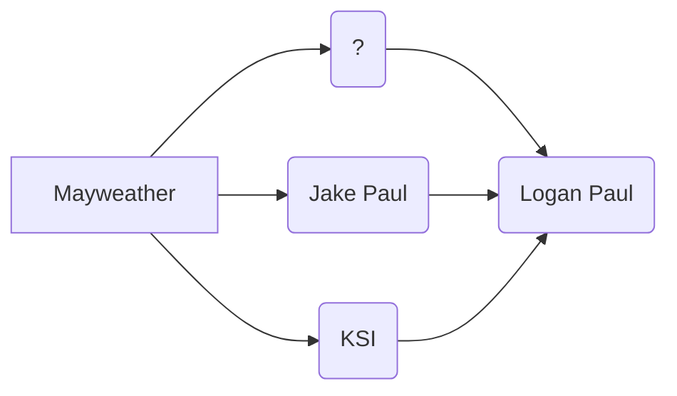

# litepaper
A document containing details about FUCKLOGAN tokenomics.

# $FUCKLOGAN Lite Paper

**Introduction**. 

This token is the capitalization of the distaste generated by the celebrity Logan Paul. Inspired by his latest stunt of tweeting about a token on the Binance Smart Chain, doing a rug pull, and then deleting the tweets. (We have them archived on our front page) Originally a fork of SAFEMOON, this token implements the same three simple functions.  

>**Reflection, LP Acquisition, and Burn.**

This token is a meme.. but **a powerful meme**.
It comes fully loaded with all the same functions that SAFEMOON has.
It is indeed a **fully functioning erc-20** contract on the Binance Smart Chain.

# Token Distribution

This is where we differentiate ourselves from our competitors.

|                |Amount                        |Amount (%)                       |
|----------------|-------------------------------|-----------------------------|
|Celebrity Holder|`510,000,000,000`            |51%           |
|Liquidity Locked|`390,000,000,000`            |39%            |
|Dev Wallet       |`100,000,000,000`|10%

**Celebrity allocation** is a new emergent concept in the crypto world in which the project allocates a controlling percentage to a celebrity in the hopes of garnering support.

We have adapted and modified this concept into our token launch.

Our main target for allocation is of course **Floyd Mayweather**. If we can amuse him enough to get his attention, perhaps he will pick us up as a partner. The probability is low and so in the event that he declines or doesn't acknowledge our offer before the Logan Paul fight on June 1st, 2021, we will extend the offer through the hierarchy stated above. **If no one picks us up, we will burn that 51% allocation.**

**Liquidity Lock**

In order for this token to be traded on a dex like pancake, liquidity must initially be supplied to a pool on pancake. Luckily, we don't have to supply as much as other projects because this token supplies its own liquidity with each transaction.

**Dev Wallet**

The Dev wallet will hold 10% for things like airdrops, and as a general Emergency fund.

## Fair Launch \ Sale \ Anti-Rug Pull

All tokens in circulation, aside from the celebrity and dev allocations, are locked into the liquidity pool. This means that it is impossible for a rug pull to happen. All tokens that will ever be minted are already minted and you CANNOT mint more. See contract for more details.
